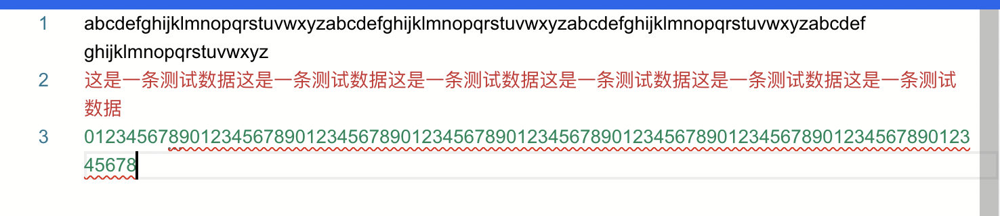

# 布局

## 编辑器大小
 在create编辑时，通过配置 [automaticLayout](../editor/interfaces/IStandaloneDiffEditorConstructionOptions.md#automaticlayout) 实现编辑器大小自适应：
 ``` javascript
    monaco.editor.create(editorRef.value, {
                value: '',
                language: "javascript",
                fixedOverflowWidgets: true,
                fontFamily: "Arial",
                fontSize: 14,
                readOnly: true,
                tabSize: 8,
                insertSpaces: true,
                wordWrap: 'on',
                wordWrapColumn: 120,
                // 默认值为false
                automaticLayout: true,
            });
 ```

::: danger 

这个属性设置设置为 true ，则编辑器会在窗口大小发生变化时自动调整大小以适应新的窗口大小。 所以需要注意的是，如果有类似于侧边栏菜单关闭和展开的逻辑，一定要保证编辑器的容器盒子能够自使用宽度变化，否则无法触发编辑器的自适应

:::

## 文本换行


monaco-editor的换行方式，主要分为3种情况：
+ 不换行
+ 按照编辑器宽度换行
+ 按照制定列数换行

主要受[wordwrap](../editor/interfaces/IStandaloneDiffEditorConstructionOptions.md#wordwrap)和[wordwrapcolumn](../editor/interfaces/IStandaloneDiffEditorConstructionOptions.md#wordwrapcolumn
)控制，具体如下：


| 取值 | 含义 |
|  :---- | :---- |
| off   |   不换行，会一直滚动 |
| on   |   换行，文本将在视区宽度内自动换行 |
| wordWrapColumn   |   当设置为 "wordWrapColumn" 时，文本将在指定的列数处自动换行 |
| bounded   |   文本将在视区宽度和指定列数的较小值处自动换行。 |

::: danger 

当设置为on的时候，每一行换行的字符数并不是确定的,只是保证字符能够填满

:::

例如下面：
字母填充84个，虽然没有铺满，依然换行了，数字填充了84个；

